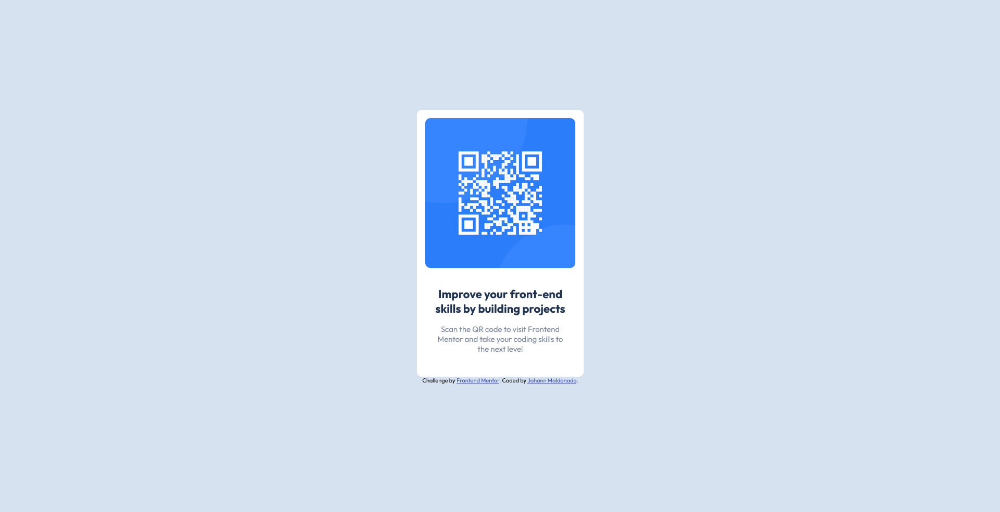

# Frontend Mentor - QR code component solution

This is a solution to the [QR code component challenge on Frontend Mentor](https://www.frontendmentor.io/challenges/qr-code-component-iux_sIO_H). Frontend Mentor challenges help you improve your coding skills by building realistic projects. 

## Table of contents

- [Overview](#overview)
  - [Screenshot](#screenshot)
  - [Links](#links)
- [My process](#my-process)
  - [Built with](#built-with)
  - [What I learned](#what-i-learned)
  - [Continued development](#continued-development)
- [Author](#author)

## Overview

### Screenshot

### Links

- Solution URL: [Add solution URL here](https://github.com/Johann-Alpha/FrontendMentor-Solutions/tree/main/qr-code-component-main)

## My process
I created a div for the container, then created a container for the two pieces of text and some margins. 

### Built with

- HTML5
- CSS3

### What I learned

This challenge made me aware that I still have a lot to learn in web development. Of course, I have a lot of theoretical knowledge, but this simple challenge made me reaise that I needed to continue practising my skills until I really know them.

### Continued development

I would like to learn floats and how to work with them. That technique has already been replaced by Flexbox and Grid, but I would like to learn it just in case.

## Author

- Website - [Johann Maldonado](https://johannmaldonado.com)
- Frontend Mentor - [@Johann-Alpha](https://www.frontendmentor.io/profile/Johann-Alpha)
